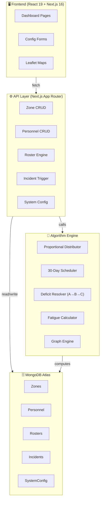
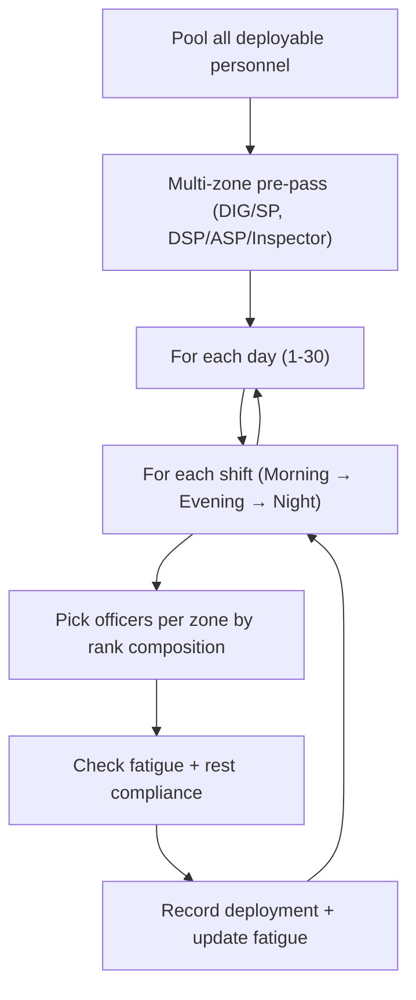
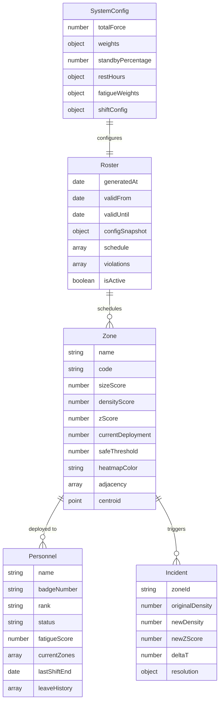
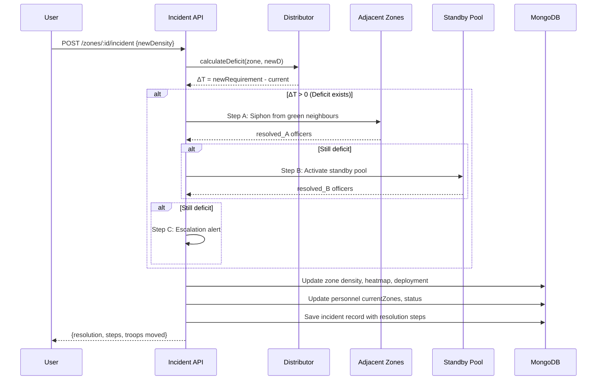

<p align="center">
  
  
  
  
  
</p>

# 🛡️ Operation Sentinel

**Intelligent Police Workforce Scheduling & Dynamic Resource Allocation System**

> A scale-agnostic, algorithmic platform for real-time police deployment across zones — featuring dynamic roster generation, incident auto-resolution, fatigue management, and live force redistribution.

---

## 🏗️ System Architecture



---

## 🔄 Core Workflow

```mermaid
flowchart LR
    A["🏗️ Create Zones"] --> B["👮 Add Personnel"]
    B --> C["⚙️ Configure System"]
    C --> D["📊 Redistribute Forces"]
    D --> E["📅 Generate Roster"]
    E --> F["🚨 Handle Incidents"]
    F --> G["🔄 Auto-Resolve"]
    G -->|"A: Adjacent Pool"| G
    G -->|"B: Standby Reserve"| G
    G -->|"C: Escalation"| G

    style A fill:#3b82f6,color:#fff
    style B fill:#8b5cf6,color:#fff
    style C fill:#f59e0b,color:#fff
    style D fill:#10b981,color:#fff
    style E fill:#06b6d4,color:#fff
    style F fill:#ef4444,color:#fff
    style G fill:#f97316,color:#fff
```



---

## 🧰 Tech Stack

| Layer | Technology | Why |
|-------|-----------|-----|
| **Framework** | Next.js 16 (App Router) | Server-side rendering, API routes, file-based routing |
| **UI** | React 19 + TypeScript 5 | Type-safe components with latest concurrent features |
| **Styling** | Tailwind CSS 4 | Utility-first CSS, custom design tokens for dark theme |
| **Database** | MongoDB Atlas + Mongoose 9 | Flexible schema for zone/personnel documents, geospatial indexing |
| **Auth** | NextAuth.js 4 | Credential-based admin authentication with bcrypt |
| **Maps** | React-Leaflet 5 | Interactive geospatial zone mapping + heatmap overlays |
| **Charts** | Recharts 3 | Data visualisation for fatigue, deployment, coverage |
| **Forms** | React Hook Form + Zod 4 | Validated, performant form handling |
| **Icons** | Lucide React | 1000+ consistent SVG icons |
| **Theming** | next-themes | Dark/light mode with system preference detection |

---

## 🧠 Algorithms

### 1. Proportional Force Distributor
**File:** `lib/algorithms/proportionalDistributor.ts`

Distributes total force across zones proportional to threat severity using the Z-Score formula:

```
Z = (w_s × S + w_d × D) / (w_s + w_d)
```

| Variable | Meaning | Default |
|----------|---------|---------|
| `S` | Size Score (1-10) | — |
| `D` | Density Score (1-10) | — |
| `w_s` | Size weight | 0.3 |
| `w_d` | Density weight | 0.7 |

**Process:**
1. Reserve standby pool (default 15%)
2. Calculate Z-score per zone
3. Allocate active force proportionally: `Allocation_i = (Z_i / ΣZ) × ActiveForce`
4. Floor allocations, distribute remainders to highest-fractional zones
5. Validate minimum composition (Inspector + SI + ASI per zone)

---

### 2. 30-Day Roster Scheduler
**File:** `lib/algorithms/scheduler.ts`

Generates a complete 30-day, 3-shift deployment schedule:



**Key Features:**
- **Rank-based composition**: Each zone gets proportional SI/ASI/HC/Constable assignments
- **Multi-zone officers**: DIG/SP get zone clusters; DSP/ASP/Inspector get 1-3 adjacent zones
- **Fatigue-aware**: Officers sorted by lowest fatigue first, exhausted officers excluded
- **Rest compliance**: Enforces 8hr (lower ranks) / 12hr (inspectors) minimum rest

---

### 3. Deficit Resolver (A → B → C Cascade)
**File:** `lib/algorithms/deficitResolver.ts`

Auto-resolves personnel deficits when incidents spike zone density:

| Step | Strategy | Source |
|------|----------|--------|
| **A** | Adjacent Zone Pooling | Siphon surplus from green neighbour zones (max 30% per zone) |
| **B** | Global Reserve Activation | Deploy from 15% standby pool |
| **C** | Escalation Alert | Flag for manual override when all reserves depleted |

---

### 4. Fatigue Calculator
**File:** `lib/algorithms/fatigueCalculator.ts`

Multi-factor fatigue scoring system:

| Factor | Points | Condition |
|--------|--------|-----------|
| Standard Shift | 1.0 | Day/Evening shift |
| Night Shift | 1.5 × multiplier | Night shift |
| Emergency | 3.0 | Incident deployment |

**Fatigue Bands:** Low (0-5) → Moderate (5-10) → High (10-15) → Critical (15+)

- Critical fatigue → blocked from all zones
- High fatigue → blocked from red/orange zones
- Daily decay: -1.0 points per rest day

---

### 5. Graph Engine
**Files:** `lib/algorithms/graph/`

| Module | Purpose |
|--------|---------|
| `adjacencyBuilder.ts` | Builds zone adjacency matrix using centroid distance (Haversine formula) |
| `pathfinder.ts` | Shortest path between zones for personnel transfer routing |
| `centrality.ts` | Betweenness centrality for identifying critical junction zones |

---

## 📡 API Endpoints

### 🗺️ Zone Management

| Method | Endpoint | Description |
|--------|----------|-------------|
| `GET` | `/api/zones` | List all active zones (sorted by Z-score desc) |
| `POST` | `/api/zones` | Create a new zone with size/density scores |
| `GET` | `/api/zones/[zoneId]` | Get zone details |
| `PATCH` | `/api/zones/[zoneId]` | Update zone configuration |
| `DELETE` | `/api/zones/[zoneId]` | Delete a zone |
| `GET` | `/api/zones/[zoneId]/personnel` | List personnel deployed to a zone |
| `POST` | `/api/zones/[zoneId]/incident` | Trigger density spike → auto-resolve via A→B→C |
| `POST` | `/api/zones/[zoneId]/absence` | Simulate mass absence → trigger deficit resolution |
| `POST` | `/api/zones/[zoneId]/deploy` | Manual deployment override |
| `POST` | `/api/zones/redistribute` | Optimistic-lock zone redistribution |

---

### 👮 Personnel Management

| Method | Endpoint | Description |
|--------|----------|-------------|
| `GET` | `/api/personnel` | List all personnel with filtering |
| `POST` | `/api/personnel` | Add a new officer |
| `GET` | `/api/personnel/[officerId]` | Get officer details |
| `PATCH` | `/api/personnel/[officerId]` | Update officer info |
| `DELETE` | `/api/personnel/[officerId]` | Remove officer |
| `POST` | `/api/personnel/[officerId]/leave` | Apply leave (auto-patches deployments) |
| `DELETE` | `/api/personnel/[officerId]/leave` | Cancel leave |
| `GET` | `/api/personnel/[officerId]/fatigue` | Get fatigue history |
| `GET` | `/api/personnel/available` | List available (non-deployed) officers |
| `POST` | `/api/personnel/bulk` | Bulk import officers |
| `POST` | `/api/personnel/seed` | Seed sample personnel data |

---

### 📅 Roster Management

| Method | Endpoint | Description |
|--------|----------|-------------|
| `GET` | `/api/roster?active=true` | Fetch active roster |
| `POST` | `/api/roster` | Generate 30-day roster + deploy Day 1 |
| `GET` | `/api/roster/shift?date=X&shift=Y` | Get shift details (zones + personnel) |
| `GET` | `/api/roster/[date]` | Get roster for specific date |

---

### ⚙️ System Configuration

| Method | Endpoint | Description |
|--------|----------|-------------|
| `GET` | `/api/settings` | Get current system config |
| `POST` | `/api/settings` | Update global parameters |
| `GET` | `/api/graph` | Get zone adjacency graph |
| `GET` | `/api/health` | Health check endpoint |
| `POST` | `/api/seed/admin` | Seed admin user |

---

## 📊 Data Models



---

## 🖥️ Dashboard Pages

| Page | Route | Description |
|------|-------|-------------|
| **Dashboard Home** | `/dashboard` | System overview with key metrics |
| **Zone Overview** | `/dashboard/zones` | Zone cards, heatmap view, deployment map |
| **Zone Detail** | `/dashboard/zones/[zoneId]` | Zone metrics, deployed personnel table |
| **Personnel** | `/dashboard/personnel` | Officer list with status tabs, leave management |
| **Officer Detail** | `/dashboard/personnel/[officerId]` | Individual officer profile + fatigue history |
| **Roster** | `/dashboard/roster` | 30-day weekly deployment grid |
| **Incidents** | `/dashboard/incidents` | Incident simulation & auto-resolution engine |
| **Settings** | `/dashboard/settings` | System configuration (weights, standby %, rest hours) |

---

## 🚀 Getting Started

### Prerequisites
- Node.js 18+
- MongoDB Atlas cluster (or local MongoDB)

### Installation

```bash
# Clone the repository
git clone <repo-url>
cd modisarkar-hackathon

# Install dependencies
npm install

# Configure environment
cp .env.example .env.local
# Edit .env.local with your MongoDB URI and NextAuth secret

# Run development server
npm run dev
```

### Environment Variables

```env
MONGODB_URI=mongodb+srv://<user>:<pass>@<cluster>.mongodb.net/<db>
NEXTAUTH_SECRET=<random-secret>
NEXTAUTH_URL=http://localhost:3000
```

### Initial Setup Flow

1. **Seed Admin** → `POST /api/seed/admin`
2. **Configure System** → `/dashboard/settings` (set total force, weights, standby %)
3. **Create Zones** → `/dashboard/zones` → Create New Zone
4. **Add Personnel** → `/dashboard/personnel` or `POST /api/personnel/seed`
5. **Redistribute Forces** → Click "Redistribute Forces" on zones page
6. **Generate Roster** → `/dashboard/roster` → Generate 30-Day Roster

---

## 📐 Incident Resolution Flow



---

## 📁 Project Structure

```
modisarkar-hackathon/
├── app/
│   ├── api/                    # API routes (22 endpoints)
│   │   ├── zones/              # Zone CRUD + incident + absence
│   │   ├── personnel/          # Personnel CRUD + leave + fatigue
│   │   ├── roster/             # Roster generation + shift details
│   │   ├── settings/           # System configuration
│   │   └── graph/              # Zone adjacency graph
│   ├── dashboard/              # Dashboard pages (11 pages)
│   └── layout.tsx              # Root layout with theme provider
├── components/
│   ├── dashboard/              # ZoneCard, Heatmap, Map, AlertBanner
│   └── forms/                  # ZoneConfigForm, MapLocationPicker
├── lib/
│   ├── algorithms/             # Core algorithmic engine
│   │   ├── proportionalDistributor.ts
│   │   ├── scheduler.ts
│   │   ├── deficitResolver.ts
│   │   ├── fatigueCalculator.ts
│   │   └── graph/              # adjacencyBuilder, pathfinder, centrality
│   ├── constants/              # ranks, shifts, thresholds
│   ├── db/                     # MongoDB connection + Mongoose models
│   └── types/                  # TypeScript type definitions
└── public/                     # Static assets
```

---

## 🔑 Key Design Decisions

| Decision | Rationale |
|----------|-----------|
| **Scale-agnostic** | All parameters are dynamic via SystemConfig — works for 100 or 100,000 officers |
| **Standby reserved for incidents** | 15% standby pool is never used in normal deployment — only activated during incident Step B |
| **Fatigue-aware scheduling** | Officers with high fatigue are deprioritised; critical fatigue blocks deployment entirely |
| **Optimistic locking** | Zone redistribution uses version field to prevent concurrent update conflicts |
| **Inline auto-resolution** | Incidents are resolved server-side immediately — no manual intervention needed for Steps A & B |
| **Rank-based multi-zone** | Senior officers (DIG/SP) manage zone clusters; mid-level officers get 1-3 adjacent zones |

---

<p align="center">
  <strong>Built for SIH 2024 · Team Modi Sarkar</strong>
</p>
